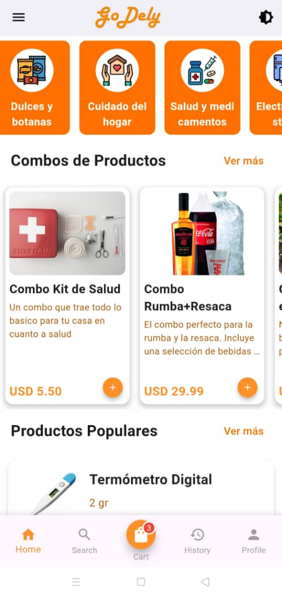
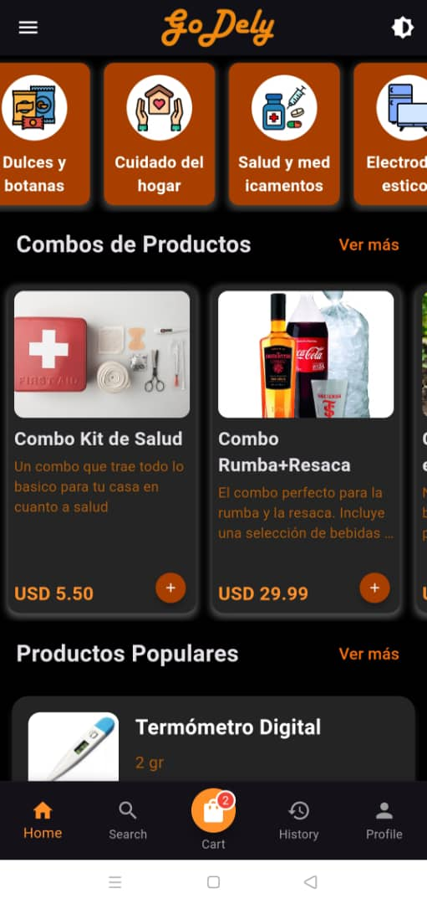
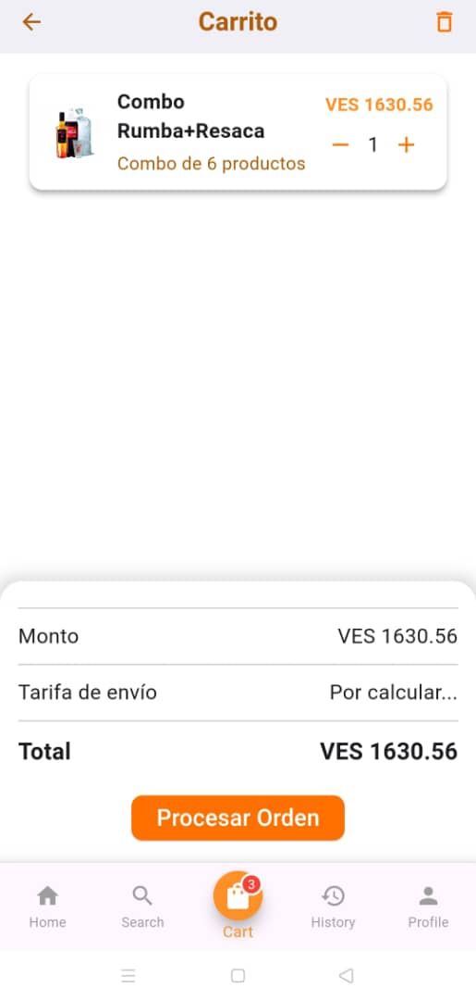
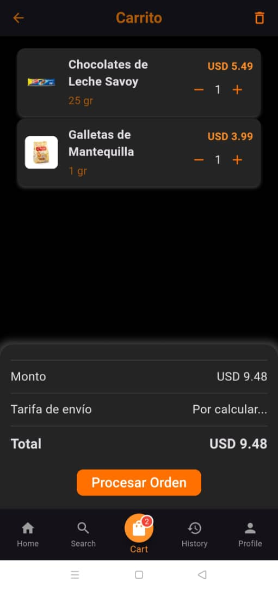
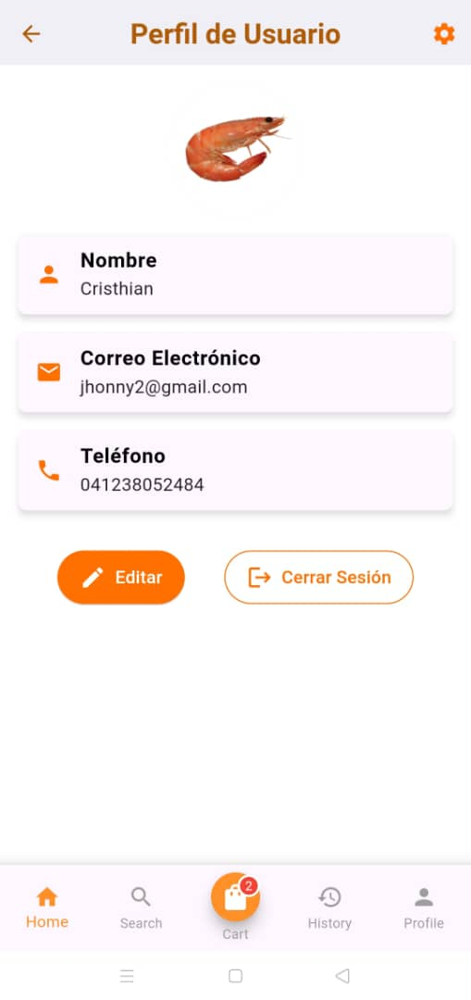
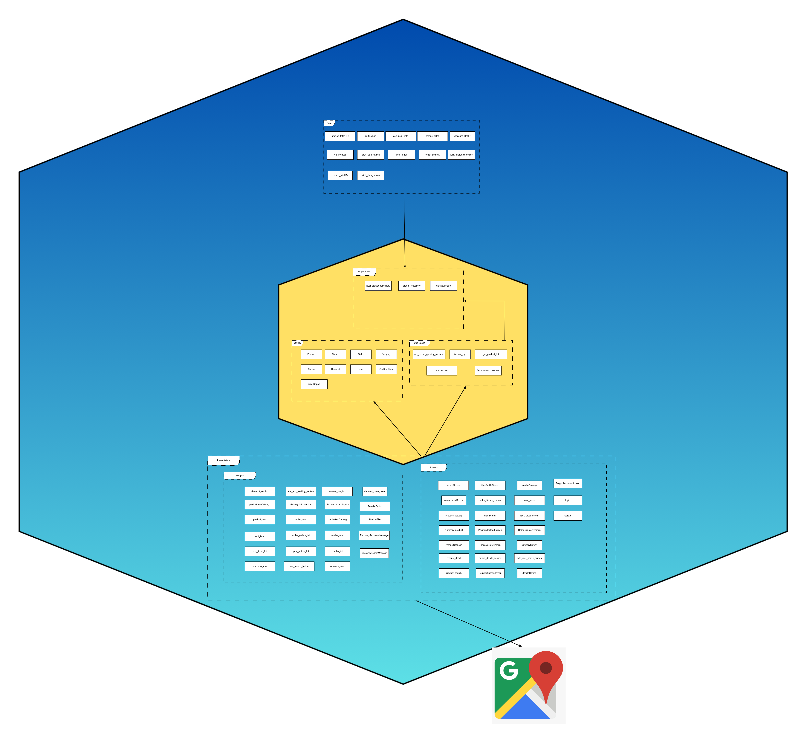

<p align="center">
    <h1>Bienvenido a nuestro repositorio de nuestra aplicacion GoDely</h1>
</p>

<p align="center">
    
</p>

---

Hola, somos el Grupo Naranja, creadores de Godely, una aplicación desarrollada con Flutter. Godely está diseñada para ofrecer una experiencia eficiente que permite realizar pedidos, gestionar cuentas y rastrear órdenes en tiempo real.

### 🌟 Características principales:
- Autenticación de usuarios.
- Cambio de moneda (USD, VES, EUR).
- Gestión de perfiles.
- Seguimiento de órdenes con integración de mapas.
- Gestión de cuentas y compras de productos y combos.
- Modo oscuro y diseño responsivo.

## 🏗️ Arquitectura 🏗️  

Nuestra aplicación está basada en la arquitectura **Clean**, inspirada en los principios de la **arquitectura hexagonal**. Este enfoque permite una separación clara de responsabilidades y promueve un diseño modular, escalable y fácil de mantener.  

### Estructura Principal  

1. **Capa de Dominio**  
   - Contiene las reglas de negocio y casos de uso.  
   - Es completamente independiente de cualquier detalle de implementación, asegurando que la lógica principal no dependa de frameworks o bibliotecas externas.  

2. **Capa de Datos**  
   - Se encarga de interactuar con fuentes externas, como APIs, bases de datos u otros servicios.  
   - Utiliza repositorios para proporcionar abstracciones, manteniendo el dominio aislado de los detalles de almacenamiento.  

3. **Capa de Presentación**  
   - Gestiona la interacción del usuario y el estado de la interfaz.  
   - Implementa patrones reactivos (como BLoC o Provider en Flutter) para asegurar una experiencia fluida y dinámica. 
   Al seguir este enfoque, Godely asegura que los componentes sean modulares, escalables y fáciles de mantener, promoviendo una alta cohesión y un bajo acoplamiento entre sus partes.


## 🖼️ Capturas de Pantalla
A continuación, ejemplos visuales de la aplicación:

### Pantalla Principal
<p align="center">
    
    
</p>

### Carrito de Compras
<p align="center">
    
    
</p>


### Perfil Usuario
<p align="center">
    
    
</p>


## 👥 Participantes del Proyecto

### Cristhian Mendes
<p align="left">
    
</p>

### Alejandra Ferreira
<p align="left">
    
</p>

### Manuel Tirado
<p align="left">
    
</p>

## ✅ Lista de Aportes

### Christian Mendes
- ✅ Pantalla de lista de combos.
- ✅ Lógica de menú principal.
- ✅ Pantalla de categorías de producto.
- ✅ Diseño de interfaces de Registro y Log-In en Figma.
- ✅ Pantalla de Log-In.
- ✅ Pantalla de registro.
- ✅ Pantalla de menú principal.
- ✅ Búsqueda de productos.
- ✅ Crear orden.
- ✅ Lógica de Log-In.
- ✅ Lógica de registro.
- ✅ Lógica de Descuentos.
- ✅ Refactorización Combo.
- ✅ Refactorización Producto.
- ✅ Implementación Carrito de Compra.
- ✅ Implementar búsquedas (Pulir).
- ✅ Mostrar precio en Dólares (USD) / Bolívares (VES) / Euro (EUR) para usuarios en Venezuela.
- ✅ Cantidad de Items en el navbar Carrito.
- ✅ Mostrar Correo único válido al momento de registrar.
- ✅ Implementar local storage.
- ✅ Implementar detalle de producto al darle a cualquiera de los productos incluidos en el combo.
- ✅ Hacer detalle producto con backend.
- ✅ Hacer que el símbolo de error imagen de combo esté en el centro y el nombre y descripción no suban.
- ✅ Mostrar los productos que tiene el combo en detalle combo.
- ✅ Arreglar bug detalle combo.
- ✅ Producto por categoría.
- ✅ Funcionalidad del mapa y tracking de la orden.
- ✅ Pulir Huella Dactilar
- ✅ Ordenar ordenes por fecha recientes
- ✅ Resumen del pedido de procesar orden colocar el descuento si tiene
- ✅ confirmar ubicacion de selecionar ubicacion
- ✅ Colocar datos reales sidebar.
- ✅ Finalizar detalle orden.
- ✅ datos pago movil precio real
- ✅ Al confirmar ubicacion que regrese a la orden
- ✅ Arreglar el perpage de ver mas
- ✅ Resumen del pedido de procesar orden colocar el descuento si tiene
- ✅ Mantener modo oscuro al volver al menu.
- ✅ Acomodar el front con la api comun.


### Alejandra Ferreira
- ✅ Pantalla de lista de combos.
- ✅ Lógica de menú principal.
- ✅ Diseño de interfaces de Registro y Log-In en Figma.
- ✅ Diseño de interfaz de pantalla de Detalle de Producto y Combo, en Figma.
- ✅ Interfaz de detalle de producto.
- ✅ Interfaz de detalle de combo.
- ✅ Interfaz de carrito de compra.
- ✅ Interfaz de lista de productos.
- ✅ Interfaz de olvidé contraseña.
- ✅ Interfaz de registro exitoso.
- ✅ Detalles UI/UX.
- ✅ Interfaz de perfil usuario.
- ✅ Interfaz de método de pago.
- ✅ Interfaz de orden de seguimiento.
- ✅ Interfaz del mapa.
- ✅ Interfaz de detalle orden.
- ✅ Cambio de fondo en la aplicación completa.
- ✅ Funcionalidad de perfil usuario.
- ✅ Interfaz de búsqueda de productos.
- ✅ Funcionalidad cambiar contraseña.
- ✅ Pulir interfaz de checkout (Métodos de pago).
- ✅ Funcionalidad de la interfaz de detalle de orden finalizada y reorden.
- ✅ Animaciones UI/UX.
- ✅ Mejorando el carrusel.
- ✅ Modo oscuro y degradado.
- ✅ Inicio de sesión con huella dactilar.
- ✅ Mejorando interfaz de configuración.
- ✅ Investigación para la implementación del mapa.
- ✅ Se realizó la interfaz de loading la pantalla de carga.
- ✅ Cambiar ícono de la aplicación.
- ✅ Menú sidebar.
- ✅ Validar que solo se pueda insertar números en prefijo y teléfono en la pantalla de registrar.
- ✅ Implementar pantalla de cuenta registrada exitosamente al darle al botón de registrar.
- ✅ Mostrar listado de regiones disponibles.
- ✅ Implementar refrescar página deslizando hacia abajo.
- ✅ Implementar ver más de combo y productos.
- ✅ Interfaz de historial de órdenes.
- ✅ Implementar carrusel.
- ✅ Agregar los ítems al ícono del carrito (detalle Combo, detalle producto).
- ✅ Funcionalidad de la lista de productos.
- ✅ Navbar
- ✅ Se agrego los datos del precio del backend al metodo de pago (zelle, credito/debito, pago movil).
- ✅ Se agrego en pefil usuario los datos estatico.
- ✅ Se modifico los dialogos de los metodos de pago al modo oscuro.
- ✅ Mejorando la interfaz de detalle orden.
- ✅ Se Mejoro la interfaz de lista combos y productos.
- ✅ Interfaz Procesar Orden.
- ✅ Mejorar el catalogo de combo.
- ✅ Mejorar el catalogo de producto.

### Manuel Tirado
- ✅ Pantalla de lista de combos.
- ✅ Lógica de menú principal.
- ✅ Diseño de interfaces de Registro y Log-In en Figma.
- ✅ Diseño de interfaz de pantalla de Detalle de Producto y Combo, en Figma.
- ✅ Refactorización para arquitectura clean en repositorio de Front.
- ✅ Implementar cambio de color naranja el círculo de carga.
- ✅ Agregar el título y el ver más de productos destacados.
- ✅ Cambiar que la tarjeta de producto sea un cuadro blanco y botón de agregar como el de combo.
- ✅ Arreglar la tarjeta de producto.
- ✅ Implementar fetch categorías.
- ✅ Refactorización de una o más funcionalidades (carrito/productos).
- ✅ Funcionalidades de orden y usuario completas perfectamente.
- ✅ Estados de la orden (recibido del backend).
- ✅ Arreglar bug de overflow en tarjeta pantalla de categoría.
- ✅ Implementar Mappers de DTO a entidades.
- ✅ Terminar de implementar pantalla de historial de órdenes dinámica (con datos de backend) (estado de la orden).
- ✅ Agregar botones a las tarjetas de historial de órdenes según el status.
- ✅ Implementar testing completamente en una funcionalidad.
- ✅ Poner cupón en orden.
- ✅ Interfaz de las categorias.
- ✅ implementar fetch de productos.
- ✅ agregar lista de productos en menu principal.
- ✅ busquedas funcionando perfectamente.

## Diagrama Godely

<p align="center">
    
</p>

---
### Empezando 
Para limpiar las dependencias, ejecute el siguiente comando:

```bash
flutter clean
```

--- 
Obtener las dependecias, ejecute el siguiente comando:
```bash
flutter pub get
```

---
### Ejecutando la aplicacion 
Selecciona el dispositivo

```bash
ctrl + shift + p & type Flutter: Select Device
```

--- 
Ejecutar la app
```bash
F5
```

---
